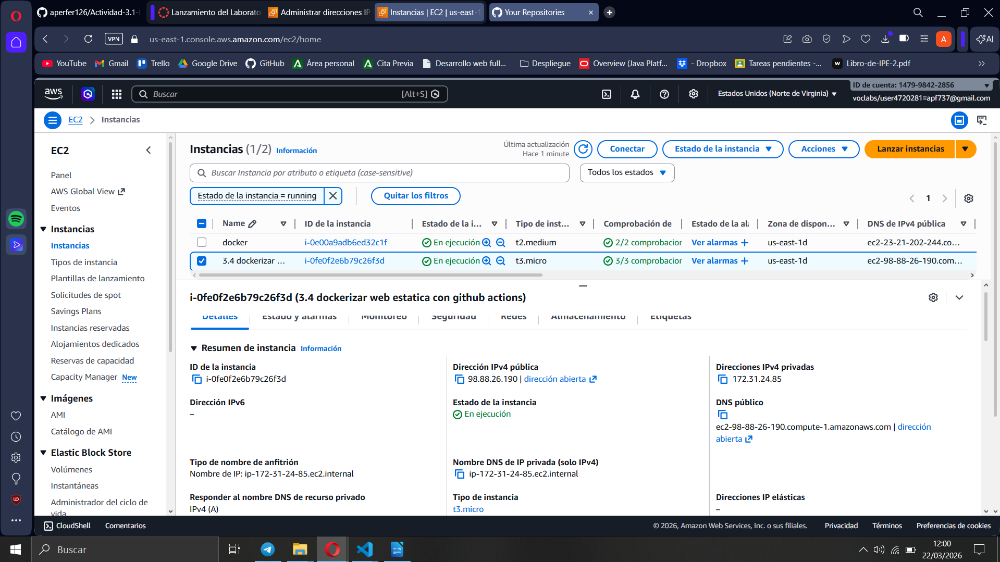
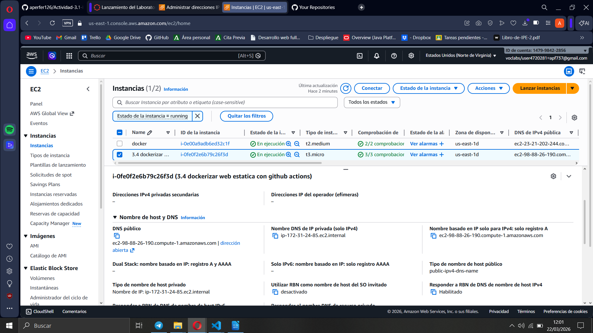
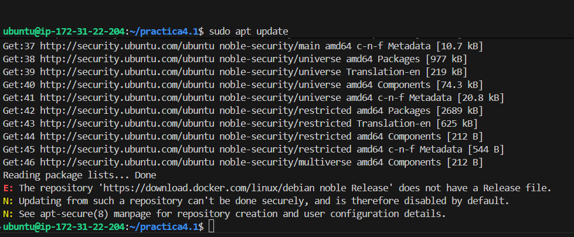
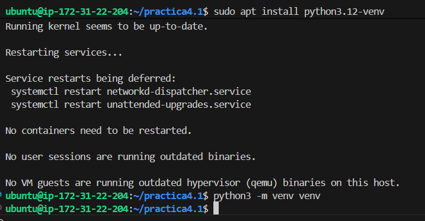
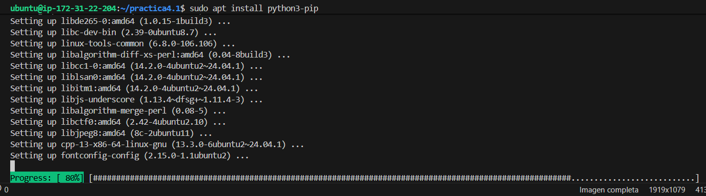
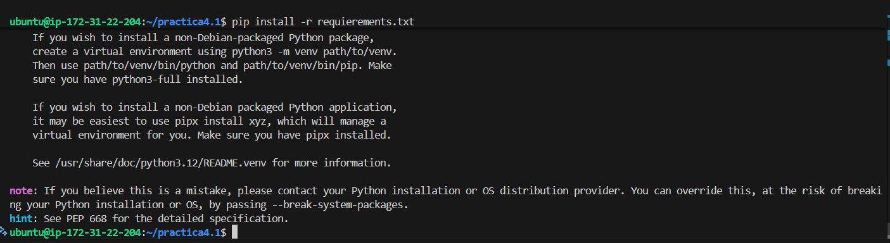
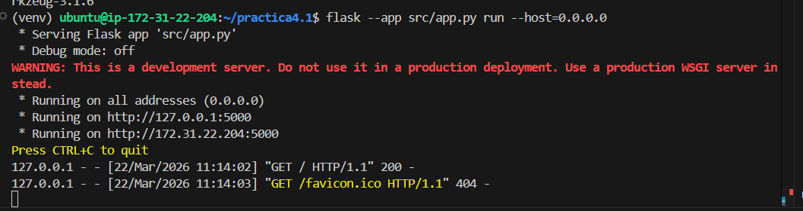
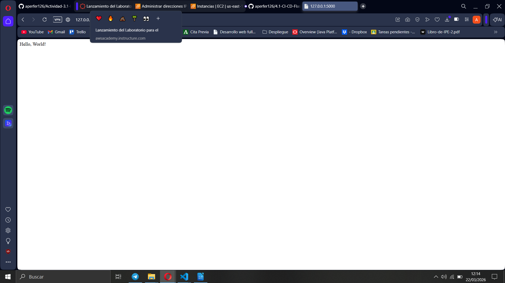
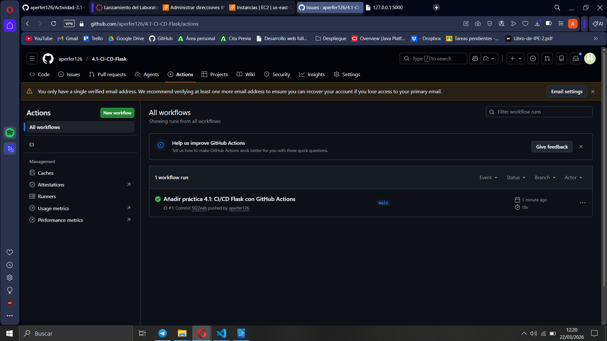
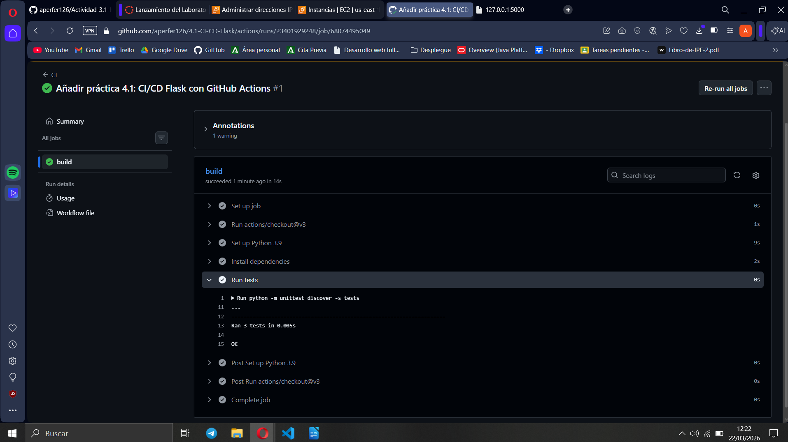

# Práctica 4.1: Introducción a CI/CD con Flask y AWS

Este repositorio documenta el despliegue manual de una aplicación Flask en una instancia EC2 y la integración de un pipeline de CI con GitHub Actions. La práctica mantiene la misma esencia: app mínima, tests automáticos y validación del flujo en GitHub.

---

## 1. Infraestructura en AWS

Se parte de una instancia EC2 en ejecución, revisando tanto su estado como los datos de red (IP/DNS) necesarios para la conexión y pruebas.




---

## 2. Preparación del entorno por SSH

Dentro del servidor se realizan los pasos de preparación del sistema y Python:

1. Actualización de paquetes.
2. Instalación de herramientas necesarias (`python3-pip` y `python3.12-venv`).
3. Creación del entorno virtual.

Durante la actualización aparece un aviso de repositorio Docker no válido para `noble`, que no impide continuar con la práctica Flask.





Al intentar instalar dependencias directamente con `pip` del sistema, aparece el error de entorno gestionado externamente. La solución es instalar dentro del entorno virtual:

```bash
source venv/bin/activate
pip install -r requirements.txt
```



---

## 3. Ejecución de Flask y validación funcional

Se lanza la aplicación con Flask escuchando en todas las interfaces:

```bash
flask --app src/app.py run --host=0.0.0.0
```

Resultado observado:

- App iniciada correctamente.
- Respuesta `200` en la ruta principal.
- Registro `404` para `favicon.ico`, comportamiento esperado.




---

## 4. Integración Continua con GitHub Actions

Se configura el workflow de CI para ejecutarse automáticamente en `push` y `pull_request` hacia `main`.

### Mejoras realizadas

- Nuevos tests para `/health` y para error `404`.
- Automatización en `.github/workflows/ci.yml`.

### Resultado de integración

- El workflow aparece en la vista **All workflows**.
- La ejecución finaliza en verde.
- Se confirma la ejecución satisfactoria de 3 tests unitarios.




---

## 5. Estructura del proyecto

```text
practica4.1/
├── .github/workflows/ci.yml
├── src/app.py
├── tests/test.py
├── requirements.txt
├── Dockerfile
└── README.md
```

---

## 6. Tecnologías utilizadas

- Python 3.9+ / Flask
- unittest
- GitHub Actions
- AWS EC2 (Ubuntu)